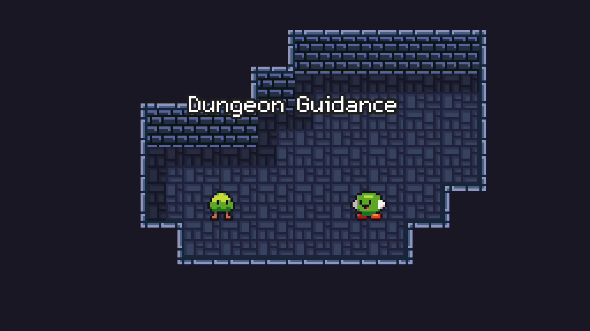

<a href="https://senhung.itch.io/dungeon-guidance">
    

        
    

</a>

    You play as enemies to guide the hero to the next level. 

---

    A game made for <a href="https://itch.io/jam/gmtk-2020">GMTK2020</a>.

<a href="https://itch.io/jam/gmtk-2020">
    

        
    

</a>

    Theme: 
    Out of Control

<a href="https://itch.io/jam/gmtk-2020">
    

        
    

</a>

## Controls

|        Key        |                Action                |
| :---------------: | :----------------------------------: |
| WASD / Arrow Keys |                 Move                 |
|    Left Mouse     | Control Monster / Get Out of Control |
|    Right Mouse    |              Scroll Map              |

## Credits

### Sprites

- [Sprite Pack 1](https://grafxkid.itch.io/sprite-pack-1)
- [Mini FX, Items & UI](https://grafxkid.itch.io/mini-fx-items-ui)
- [Simple Dungeon Crawler 16x16 Pixel Art Asset Pack](https://o-lobster.itch.io/simple-dungeon-crawler-16x16-pixel-pack)
- [16x16 Dungeon Tileset](https://0x72.itch.io/16x16-dungeon-tileset)
- [Top-Down Roguelike Dungeon Tileset 16x16](https://redsteve.itch.io/top-down-dungeon-tileset)

### Music

- [Wake Up](https://onemansymphony.bandcamp.com/track/wake-up)

### Fonts

- [m5x7](https://managore.itch.io/m5x7)
